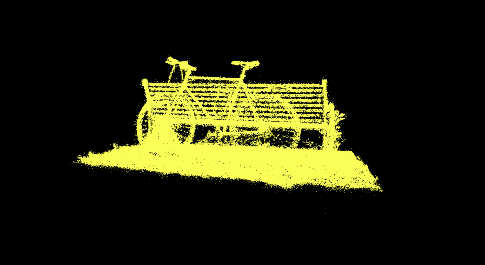

# Project5-WebGPU-Gaussian-Splat-Viewer

**University of Pennsylvania, CIS 565: GPU Programming and Architecture, Project 5**

* Marcus Hedlund
  * [LinkedIn](https://www.linkedin.com/in/marcushedlund/)
* Tested on: Windows 11, Intel Core Ultra 9 185H @ 2.5 GHz 16GB, NVIDIA GeForce RTX 4070 Laptop GPU 8GB (Personal Computer)

### Live Demo

### Demo Video/GIF

### Overview

In this project I implement a real-time WebGPU Gaussian Splat Viewer that renders scenes using neural point clouds based on the paper [3D Gaussian Splatting for Real-Time Radiance Field Rendering](https://repo-sam.inria.fr/fungraph/3d-gaussian-splatting/). Scenes are loaded from .ply files and can be displayed as either point clouds or Gaussian splats. The Gaussian splat method uses 3D Gaussian distributions in order to represent geometry. It maps these 3D Gaussians to 2D screen-space conics using the Jacobian of the projection matrix, and performs View-Frustrum culling to only evaluate Gaussians that the camera can see. Additionally, during preprocessing it leverages spherical harmonics to evaluate color and sorts the splats by depth. Then in the rendering pass, we render a quad per splat and use the conic to apply exponential falloff for opacity and composite the Gaussians through alpha-blending to produce the final image.

|||
|:--:|:--:|
| *Point Cloud Renderer* | *Gaussian Splat Renderer* |

#### Comparing Point Cloud and Gaussian Renderer

Visually, the point cloud method renders the scene as just that, a collection of points each of the same color. Surprisinngly this method is actually able to do a fairly good job of encoding what is represented in the scene as can be seen in the above image, but it still leaves much to be desired. Gaussian splatting on the other hand is able to leverage the process to fully recreate a scene. It has accurate color, texture, and overall has an extrextremelymely realistic appearance. Performance-wise though as expected the point cloud method performs much better. In this case for the above scene I got 4.11 ms/frame for the point cloud and 6.58 ms/frame for the Gaussian Splasplattingtting. This makes a lot of sense because of how much more involved the Gaussian splatting is, having to perform many precomputations like 3D covariance, 2D conics, color, sorting, and opacity falloff instead of just creating points. 

#### Workgroup Size Effect on Performance

Decreasing the workgroup size will generally lower the performance of Gaussian splatting. This is because it makes it so not as many splats can be processed in parallel, slowing down the computation. For me, I achieved maximum performance at a workgroup of size 256. This is likely because at higher workgroup sizes there is too high of an overhead in both dispatch time and memory pressure, and the GPU will already be saturated so the additional workgroups don't fully leverage additional parallelism, resulting in slower computation.

#### View-Frustrum Culling Effect on Performance

I additionally performed view-frustrum culling during preprocessing by creating a bounding box around the camera's frustrum (extended by 1.2x in x and y to account for gaussians slightly outside the frustrum that could still influence the image) and not processing gaussians that fall outside that range. This was able to greatly improve performance when the camera was positioned closer to the scene so that not all of the gaussians were in sight, however there was close to no effect when the camera was positioned farther away so that all gaussians were visible. This makes sense because when we are actually able to cull Gaussians and not process them through View-Frustrum Culling it just leads to us having to process fewer items in each of the subsequent steps, leading to quicker computation time.

#### Number of Gaussians Effect on Performance

We are able to compare the effect the number of Gaussians has on performance by looking at different scenes with a higher or lower amount of points in them. As can be expected increasing the number of Gaussians in a scene decreases the performance of our viewer. This is because we will have a larger number of Gaussians to compute information for and process, leading to higher compute time and lower performance.

### Credits

- [Vite](https://vitejs.dev/)
- [tweakpane](https://tweakpane.github.io/docs//v3/monitor-bindings/)
- [stats.js](https://github.com/mrdoob/stats.js)
- [wgpu-matrix](https://github.com/greggman/wgpu-matrix)
- Special Thanks to: Shrek Shao (Google WebGPU team) & [Differential Guassian Renderer](https://github.com/graphdeco-inria/diff-gaussian-rasterization)
